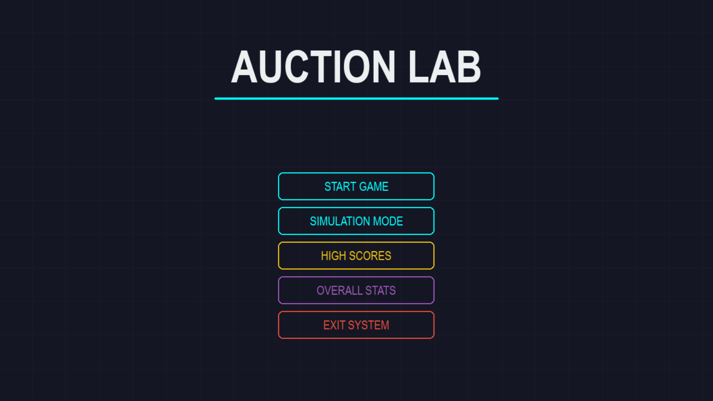
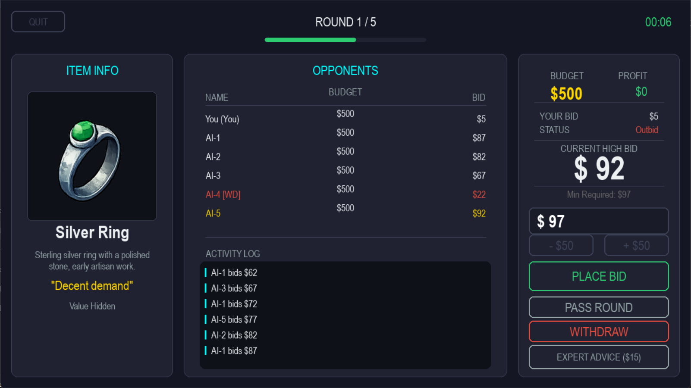
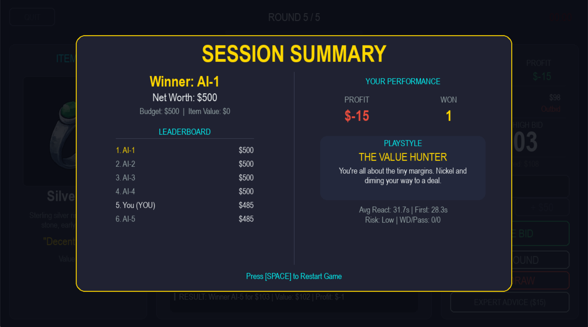
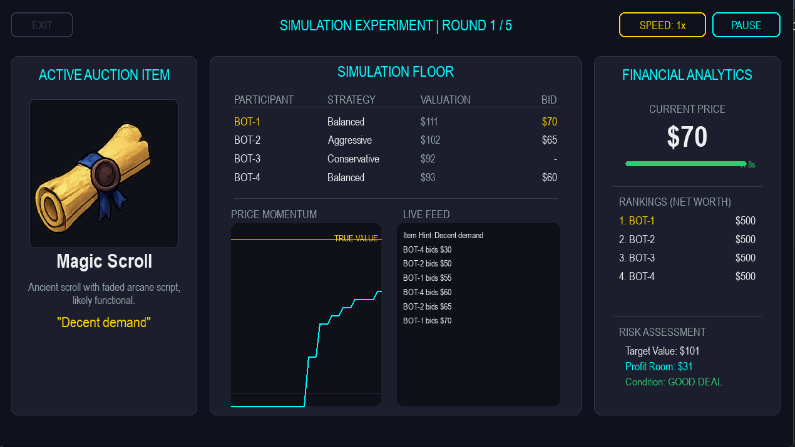
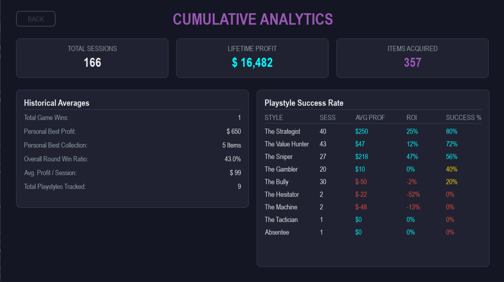

<div align="center">   
  <h1>🏷️ AuctionLab</h1>   
  <p><strong>A discrete-time auction simulation with autonomous AI agents, strategic bidding mechanics, and formal evaluation tooling.</strong></p>   
  <p>   
       
       
       
  </p>   
</div>  
  
---  
  
## 📚 Table of Contents

- [Glimpse of Project](#%EF%B8%8F-glimpse-of-project)
- [Overview](#-overview)
- [Features](#-features)
- [System Architecture](#%EF%B8%8F-system-architecture)
- [Item Generation & Hint System](#-item-generation--hint-system)
- [Auction Mechanics & Pacing](#%EF%B8%8F-auction-mechanics--pacing)
- [AI Agent Architecture](#-ai-agent-architecture)
- [Tactics & Special Behaviours](#-tactics--special-behaviours)
- [Simulation & Evaluation](#-simulation--evaluation)
- [Data, Logging & Reproducibility](#-data-logging--reproducibility)
- [How to Run](#%EF%B8%8F-how-to-run)
- [Authors](#-authors)
- [License](#-license)
  
---  
## 📷 Glimpse of Project

### 🟢 Main Interface

<div align="center">
  
</div>

---

### 🎮 Live Gameplay

<div align="center">
  
</div>

---

### 📊 Session Summary

<div align="center">
  
</div>

---

### 🤖 Bot vs Bot Simulation Mode

<div align="center">
  
</div>

---

### 📈 System Statistics

<div align="center">
  
</div>


---  
## 🔍 Overview 

**AuctionLab** is a discrete-time auction simulation framework designed to model competitive bidding behavior and evaluate strategic performance. 

Items have hidden *true values* and public *hint signals*. Autonomous agents form private beliefs using stochastic transformations of these hints and engage in auctions using parametrized strategies. The system produces both fine-grained logs and aggregate statistics suitable for formal analysis.      

---  
## ✨ Features  
  
- **Hint-conditioned item generation** using probabilistic modeling    
- **Three AI strategies**: Aggressive, Balanced, Conservative    
- **Dynamic auction pacing** with tick-based progression    
- **Belief formation model** with stochastic estimation    
- **Advanced tactics**: sniping, jump bids, bluffing, spite    
- **Evaluation runner** with ROI and performance metrics    
- **Reproducible logging** and persistent statistics    
  
---  
## 🏗️ System Architecture  
  
| Component          | Description                                  |
| ------------------ | -------------------------------------------- |
| **Items**          | Generated via probabilistic hint-based model |
| **Agents**         | Strategy-driven autonomous bidders           |
| **Auction Engine** | Tick-based execution and state transitions   |
| **Config Layer**   | Centralized parameters and distributions     |
  
**Key Files**  
- `src/models/item.py`  
- `src/models/ai_agent.py`  
- `src/models/auction.py`  
- `src/config.py`  
  
---  
## 🎲 Item Generation & Hint System  
  
### 1. Hint Categories 

Items are assigned hints via weighted sampling:  
weights = [15, 25, 35, 20, 5]
This biases generation toward average-value items.  
  
---  
### 2. True Value Sampling  

Given hint range `[m, M]` and base value `b`:  

- Standard deviation:  
`sigma = (M - m) / 6`  
- Sampling:  
`X ~ Normal(b, sigma^2)`  
  
- Values are clamped to `[m, M]`  
- Final output is integer-valued

---  
### 3. Premium Hints  
  
Optional expert hints provide a narrow interval around the true value:  
  
- Fixed width (~20 units)  
- Randomized offset    
- Implemented in `get_premium_hint()`  
  
---  
## ⏱️ Auction Mechanics & Pacing  
  
- **Tick Interval**: `200 ms`    
- **Bid Increment**: `MIN_INCREMENT = 5`    
- **Patience System** controls auction duration    
  
### Auction States  
- Active    
- Going Once    
- Going Twice    
- Sold / Locked    
  
### Key Mechanics  
- New bids reset patience    
- Withdrawals are delayed (1–4 ticks)    
- Penalties applied for withdrawal as highest bidder    
  
---  
## 🤖 AI Agent Architecture

### Core State

|Field|Description|
|---|---|
|`budget`|Available funds|
|`strategy`|Assigned strategy profile|
|`estimated_value`|Private belief about item worth|
|`personal_range`|Acceptable bid range|
|`conviction_point`|Confidence threshold|
|`max_bid_limit`|Hard ceiling on bids|
|`strategic_ceiling`|Strategy-adjusted upper bound|

### Belief Formation

Agents transform hints into private estimates:

```
V_hat = floor(b * (1 + ε))
```

|Strategy|ε Range|
|---|---|
|Aggressive|`[-0.05, 0.20]`|
|Balanced|`[-0.12, 0.12]`|
|Conservative|`[-0.20, -0.02]`|

### Strategy Profiles

|Strategy|Risk Ceiling|Behavior|
|---|---|---|
|Aggressive|1.08|High risk, escalation, spite|
|Balanced|1.05|Adaptive, watch behavior|
|Conservative|0.98|Risk-averse, early withdrawal|

### Decision Flow

1. Pre-entry filtering
2. Event-driven reactions
3. Bid calculation
4. Tactical overrides

Agents continuously evaluate:

- Budget constraints
- Price vs. valuation
- Remaining auction time
   
---  
## 🎯 Tactics & Special Behaviours

|Tactic|Description|
|---|---|
|**Sniping**|Late-stage bidding to avoid driving up price|
|**Jump Bids**|Large early bids used for intimidation|
|**Bluffing**|Temporary participation without intent to win|
|**Spite Bids**|Final high bid placed just before exit|

All tactics are probabilistic and strategy-dependent.
  
---  
## 📊 Simulation & Evaluation  
  
Run via:  

`python -m src.simulation_runner`
### Outputs  
  
- `sim_gameplay_logs.txt`  
- `sim_evaluation_report.txt`  
  
### Metrics  
  
- Wins per strategy    
- Average bid    
- Profit per win    
- Total profit    

`ROI = 100 * (total_profit / total_spent)`
 
---  
## 💾 Data, Logging & Reproducibility

- Full session logs are kept in memory and optionally written to:
  - `gameplay_logs.txt`
  - `sim_gameplay_logs.txt`

- Persistent statistics and highscores are managed by:
  - `src/logic/data_manager.py`

- Stored in the `/data` directory:
  - `highscores.json`
  - `statistics.json`

- Reproducibility:
   For reproducibility: the code relies on the Python `random` module (no explicit seeding in the primary runner). To reproduce results exactly, set `random.seed(...)` at a single entry point such as `src/simulation_runner.py`.
   
---
## ▶️ How to Run

### 1. Install Python 3
Make sure Python 3.9+ is installed. Check your version:
```bash
python --version
```
### 2. Install Dependencies
Install Pygame:
```bash
pip install pygame
```
### 3. Run the Project
```bash
python main.py
```

> **Notes**
> - Run all commands from the **project root directory**
> - If `python` doesn't work, try `python3`

---
## 👥 Authors

<table> <tr> <td align="center"> <a href="https://github.com/Loona6"> <br/> <sub><b>Maisha Sanjida</b></sub> </a><br/> <a href="https://github.com/Loona6">  </a> </td> <td align="center"> <a href="https://github.com/MaishaNajAlam"> <br/> <sub><b>Maisha Naj Alam</b></sub> </a><br/> <a href="https://github.com/MaishaNajAlam">  </a> </td> </tr> </table>

---
## 📄 License  
  
This project, **AuctionLab**, is developed for **academic and research purposes only**.

---
